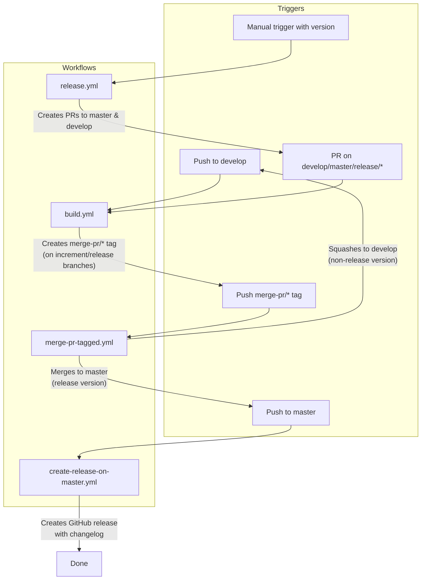

# Development Version and Branch Handling

## Branches

The versioning policy for JUDO NG modules is based on [GitFlow](https://www.atlassian.com/git/tutorials/comparing-workflows/gitflow-workflow). The branching model provides a structured workflow for feature development, releases, and hotfixes.

```mermaid
gitGraph
    commit id: "init"
    branch develop
    checkout develop
    commit id: "dev-1"
    branch feature/JNG-1
    commit id: "feat-1a"
    commit id: "feat-1b"
    checkout develop
    merge feature/JNG-1
    branch feature/JNG-2
    commit id: "feat-2a"
    checkout develop
    merge feature/JNG-2
    branch release/1.0-beta1
    commit id: "rc-1"
    branch bugfix/JNG-4
    commit id: "fix-4"
    checkout release/1.0-beta1
    merge bugfix/JNG-4
    checkout develop
    merge release/1.0-beta1
    checkout master
    merge release/1.0-beta1 id: "v1.0"
```

### Branch Types

| Branch | Base | Purpose |
|--------|------|---------|
| `develop` | — | Main development branch with the latest sources of the active version |
| `feature/JNG-NUMBER_summary` | `develop` | New feature work; merged back to `develop` when complete |
| `release/X.Y.Z` | `develop` | Release stabilization; merged to both `master` and `develop` |
| `bugfix/JNG-NUMBER_summary` | `release/*` | Fixes found during release testing; applied to release and newer versions |
| `support/JNG-NUMBER_summary` | `release/*` | Minor changes for a previous release; merged back to the release branch |
| `hotfix/JNG-NUMBER_summary` | `master` | Urgent fixes applied to both `master` and `develop` |
| `master` | — | Latest officially released sources |

## Version Numbers

Versions follow semantic versioning with these rules:

| Event | Version Action |
|-------|---------------|
| Start a `feature/` branch | No version change (inherits from `develop`) |
| Start a `release/` branch from `develop` | Increment 2nd number on `develop` |
| Start a `bugfix/` branch | No version change (inherits from release) |
| Start a `support/` branch | Increment 3rd number |
| Start a `hotfix/` branch | Increment 4th number |

### Version Formats by Branch

| Branch Type | Format | Example |
|-------------|--------|---------|
| `master`, `release/*` | `major.minor.qualifier` | `1.3.0` |
| `develop`, `increment/*` | `major.minor.qualifier.date_commitId_branchName` | `1.3.0.20240115_abc1234_develop` |

## GitHub Actions Workflows

The CI/CD system is implemented as a set of interconnected GitHub Actions workflows. Here is how they relate to each other:



### build.yml

This is the primary build workflow. It runs on pushes to `develop` and pull requests targeting `develop`, `master`, `increment/*`, or `release/*` branches.

**Steps:**
1. **Calculate version** — For `master`/`release/*` branches, uses the POM version directly. For `develop`/`increment/*`, appends a timestamp, commit ID, and branch name.
2. **Build and deploy** — Runs `mvn install` and deploys artifacts to the JUDO Nexus repository (and Maven Central for release branches).
3. **Tag** — Creates a `v<version>` git tag.
4. **Merge tag** — For `increment/*` and `release/*` branches, creates a `merge-pr/<version>` tag that triggers the merge workflow.
5. **GitHub release** — For `develop` branch, generates a changelog and creates a prerelease GitHub release.

### release.yml

Manually triggered workflow that starts a release cycle.

**Steps:**
1. Accepts a version parameter (`auto` uses the POM version, or a specific `major.minor.qualifier`).
2. Creates a pull request targeting `master` with the release version.
3. Creates a pull request targeting `develop` with the next incremented version.

### merge-pr-tagged.yml

Triggered by `merge-pr/*` tags created by the build workflow.

**Steps:**
1. If the version is in `major.minor.qualifier` format (a release), merges the PR to `master`.
2. Otherwise, squashes the PR to `develop`.
3. Deletes the `merge-pr/<version>` tag.

### create-release-on-master.yml

Triggered when code is pushed to `master` (typically via merge from a release branch).

**Steps:**
1. Generates a full changelog.
2. Creates a GitHub release marked as the latest release.

## Development Rules

> **Important:** There is no commit without a ticket number. Every commit and PR must reference a JIRA ticket in the format `JNG-xxx`.

Issue tracking: [JIRA](https://blackbelt.atlassian.net/jira/dashboards)
