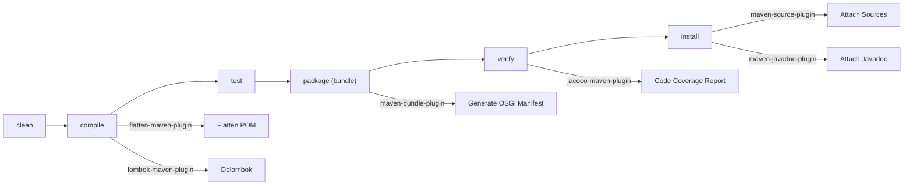

# Contributing to OSGi Liquibase

## Development Environment

### Required Software

| Tool | Version | Notes |
|------|---------|-------|
| **Java JDK** | 21 | [Azul Zulu JDK](https://www.azul.com/downloads/?version=java-21-lts&package=jdk) recommended |
| **Maven** | 3.8.x+ | Wrapper included (`./mvnw`), no local Maven install needed |

Verify your setup:

```sh
java -version
# Expected: openjdk version "21.x.x" ...

./mvnw -version
# Expected: Apache Maven 3.8.x ...
```

## Code Structure

This is a single-module Maven project that produces an OSGi bundle (`<packaging>bundle</packaging>`).

```
src/main/java/hu/blackbelt/osgi/liquibase/
    LiquibaseExecutor.java              # Service interface (public API)
    BundleResourceAccessor.java         # Loads changelogs from OSGi bundles
    StreamResourceAccessor.java         # Loads changelogs from in-memory streams
    impl/
        DefaultLiquibaseExecutor.java   # OSGi DS component implementing the service
    logging/
        Slf4jLogService.java            # Liquibase LogService -> SLF4J bridge
        Slf4jLogger.java                # Liquibase Logger -> SLF4J bridge
```

## Build Lifecycle



## Submitting an Issue

Before submitting an issue, please search the [issue tracker](https://github.com/BlackBeltTechnology/osgi-liquibase/issues) first. If your problem has not been reported, file a [new issue](https://github.com/BlackBeltTechnology/osgi-liquibase/issues/new/choose) and include:

- Output of `java -version` and `mvn -version`
- `pom.xml` or `.flattened-pom.xml` (when applicable)
- A minimal reproduction case that demonstrates the failure

A minimal reproduction allows maintainers to quickly confirm and isolate the bug.

## Submitting a Pull Request

This project follows [GitHub's standard forking model](https://guides.github.com/activities/forking/). Fork the repository, create a branch, and submit a pull request.

> **Important:** Every commit and pull request **must** reference a JIRA ticket number in the format `JNG-xxx`. There are no commits without a ticket number.

### Branch Naming Conventions

| Branch Pattern | Purpose |
|----------------|---------|
| `develop` | Main development branch (latest active version) |
| `feature/JNG-NUMBER_summary` | New features, branched from `develop` |
| `bugfix/JNG-NUMBER_summary` | Bug fixes on release branches |
| `support/JNG-NUMBER_summary` | Minor changes for previous releases |
| `hotfix/JNG-NUMBER_summary` | Urgent fixes on `master` |
| `release/X.Y.Z` | Release stabilization branches |
| `master` | Latest released sources |

For details about the CI/CD pipeline, see [CIFLOW.md](.github/CIFLOW.md).

## Commands

### Run Tests

```sh
./mvnw clean test
```

### Run Full Build

```sh
./mvnw clean install
```
