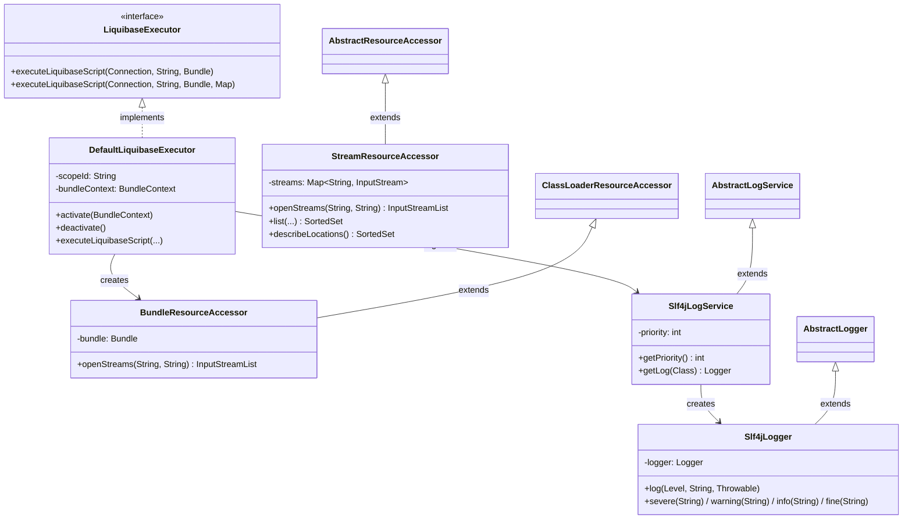
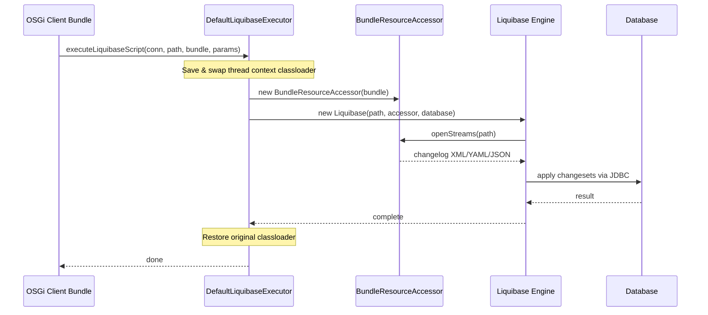
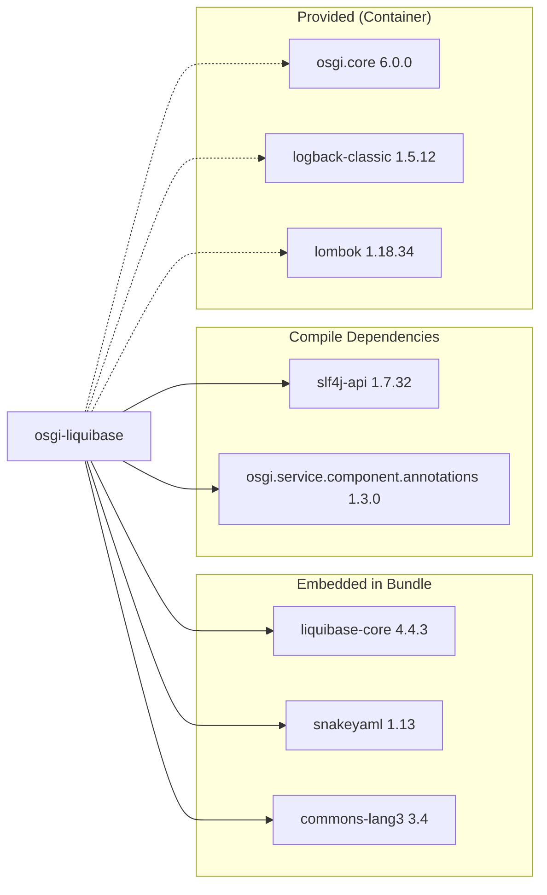

# OSGi Liquibase

[](https://github.com/BlackBeltTechnology/osgi-liquibase/actions/workflows/build.yml)

## Introduction

OSGi Liquibase is an OSGi-friendly wrapper around [Liquibase](https://www.liquibase.org/) (v4.4.3), the open-source database schema migration tool. Rather than requiring consumers to manage Liquibase's classloading quirks in an OSGi container, this project bundles Liquibase itself along with helper services into a single OSGi bundle. Other bundles in the container can simply inject the `LiquibaseExecutor` service and run changelog scripts against any JDBC connection.

The project is part of the [JUDO platform](https://github.com/BlackBeltTechnology) by BlackBelt Technology.

## Architecture

The bundle exposes a small API surface (6 classes) that bridges Liquibase into OSGi:



### How It Works



### Key Design Decisions

- **Thread context classloader manipulation**: The executor saves and replaces the thread's context classloader with its own bundle classloader before every Liquibase operation. This ensures Liquibase's `ServiceLocator` and internal class scanning work correctly inside OSGi.
- **Scope lifecycle management**: Liquibase's `Scope` is entered during `@Activate` and exited during `@Deactivate`, registering the SLF4J log service and bundle classloader as scope attributes.
- **Embedded dependencies**: `liquibase-core`, `snakeyaml`, and `commons-lang3` are inlined into the bundle JAR. Liquibase's own `ServiceLocator` and `LiquibaseLogger` classes are excluded and replaced by custom implementations.
- **SPI-based logging**: `Slf4jLogService` is registered via `META-INF/services/liquibase.logging.LogService`, bridging all Liquibase log output to SLF4J.

### Dependency Graph



## Build Commands

```sh
./mvnw clean install              # Full build (compile, test, package, install)
./mvnw clean test                 # Run tests only
./mvnw clean install -DskipTests  # Build without running tests
```

> **Note:** Requires **Java 21** (Zulu JDK recommended) and **Maven 3.8.x** (wrapper included).

## Contributing

See [CONTRIBUTING.md](CONTRIBUTING.md) for detailed instructions on submitting issues and pull requests.

## License

This project is licensed under the [Apache License 2.0](https://www.apache.org/licenses/LICENSE-2.0).
